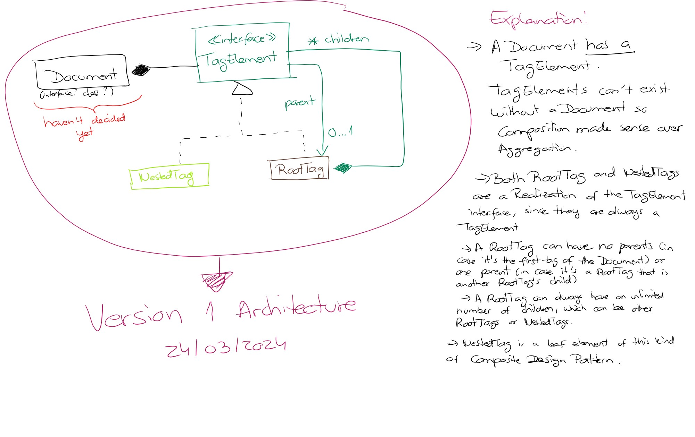
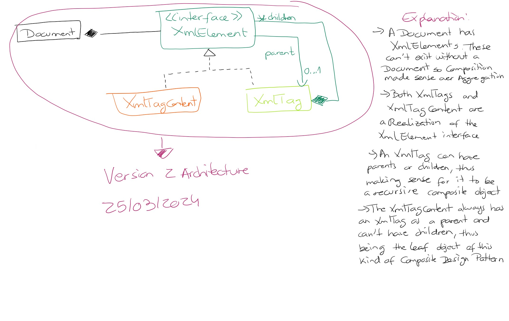

# XML Manipulation Library
Produces XML from files with a specific model

## Version 1:

This project generates a **Document** which contains **TagElement**s, which can be either **RootTag**s or **NestedTag**s.
The very rustic UML designed above is supposed to indicate that:
- A *TagElement* is directly a part of a *Document* and can't exist without being a part of one
  - For this reason, the chosen relationship between these is a <u>Composition</u>
- A *TagElement* can be a *RootTag* or a *NestedTag*
  - Because of this, the *TagElement* is the interface in common which those two will implement
  - Therefore, both of these classes are the <u>Realization</u> of the aforementioned interface
- The **<u>Composite Design Pattern</u>** was implemented for the *TagElements* since:
  - A *RootTag* is a **Composite Object** that can have itself as a child or a parent
  - A *NestedTag* always has a *RootTag* as a parent, but is considered a **Leaf Object** as it can't have children elements

### Issues:

## Version 2:

